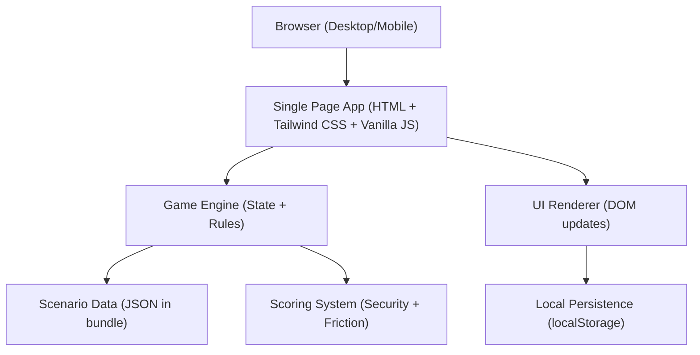
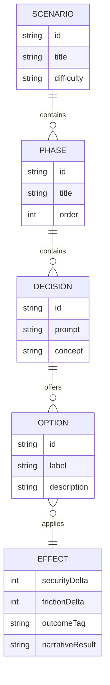

## 1. Architecture Design

## 2. Technology Description
- Frontend: HTML + Tailwind CSS + JavaScript (no framework)
- Build tooling: Vite (static SPA build) + Tailwind CLI/plugin (compiled CSS)
- Data: local JSON scenario graph embedded in the app
- Persistence: localStorage for best score, last run summary, accessibility settings
- Backend: None

## 3. Route Definitions
| Route | Purpose |
|-------|---------|
| / | Single-page game experience (all screens rendered conditionally) |

## 4. API Definitions (if backend exists)
Not applicable (no backend).

## 5. Server Architecture Diagram (if backend exists)
Not applicable (no backend).

## 6. Data Model (if applicable)

### 6.1 Data Model Definition

### 6.2 Data Definition Language
Not applicable (no database). Scenario data lives as versioned JSON.

